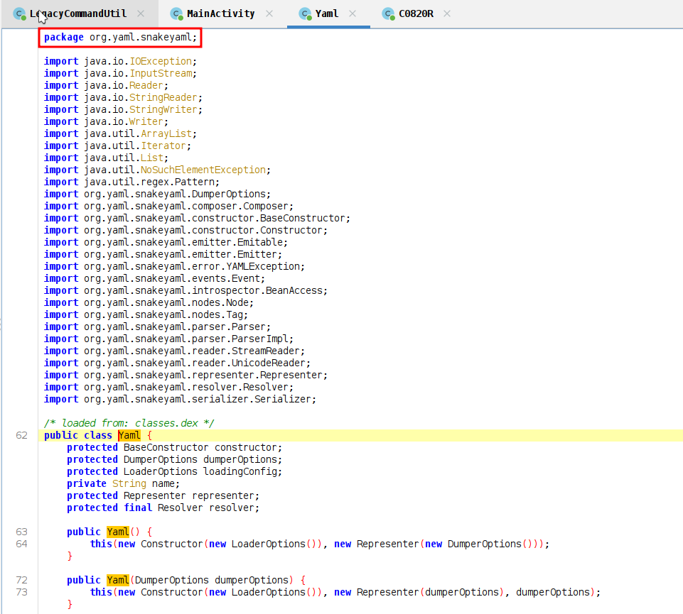
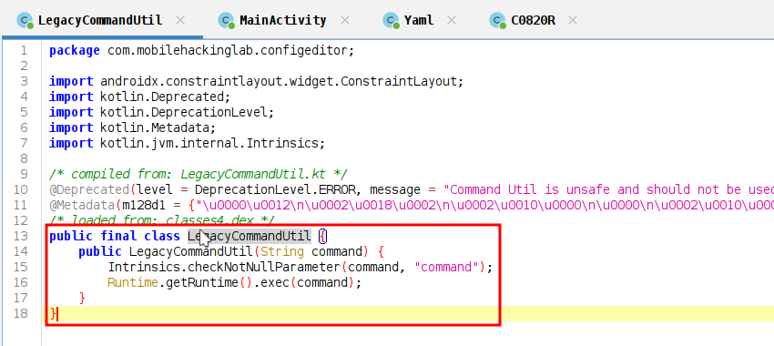
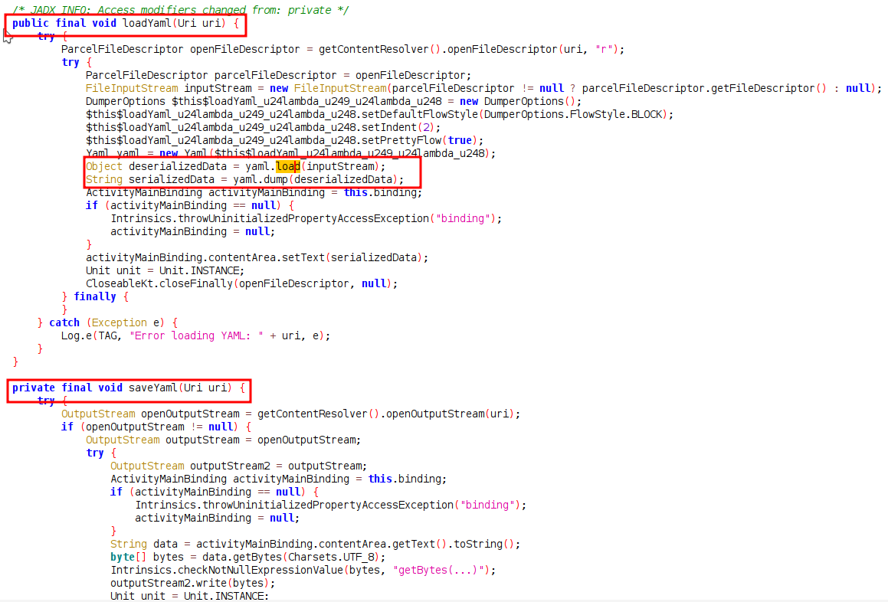
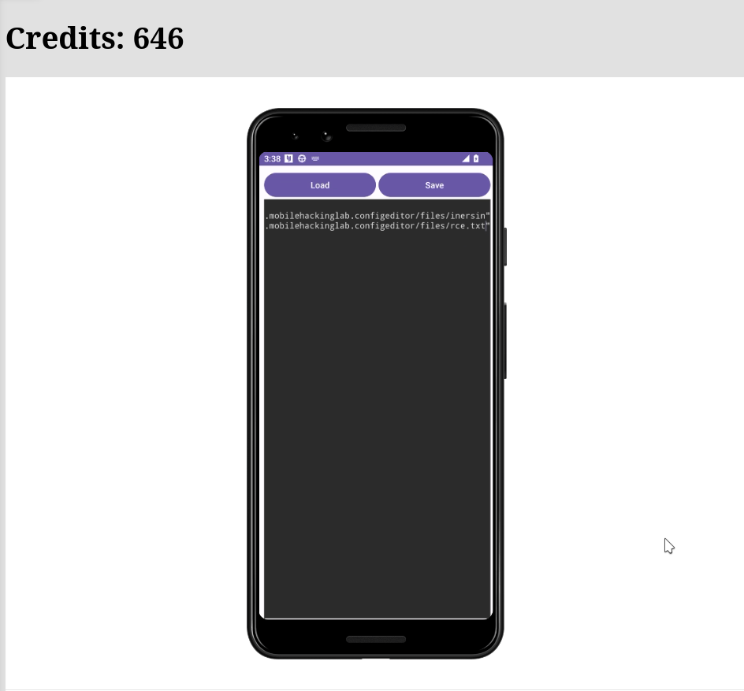
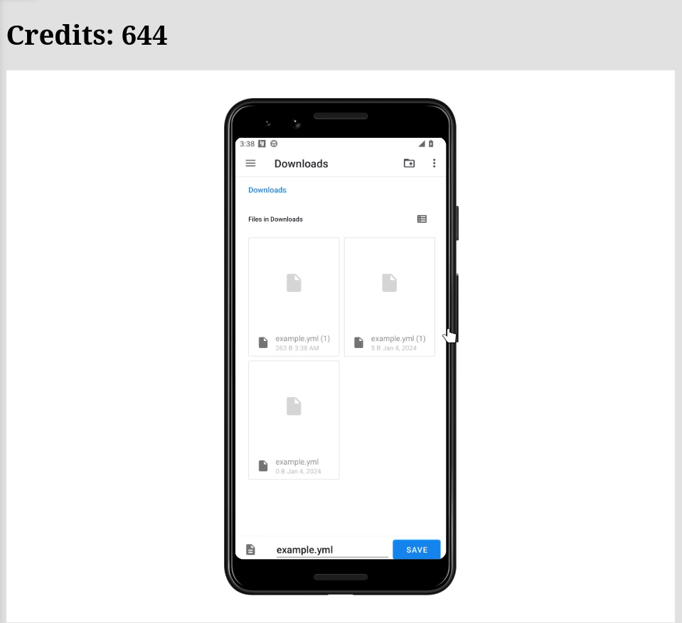
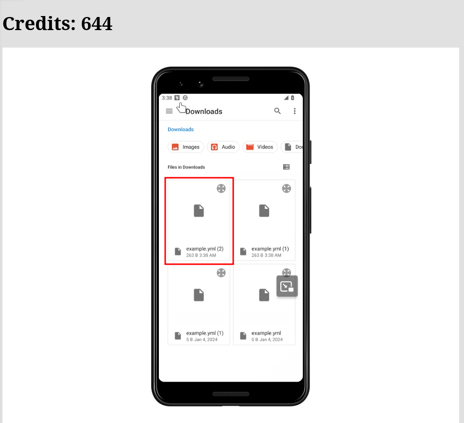
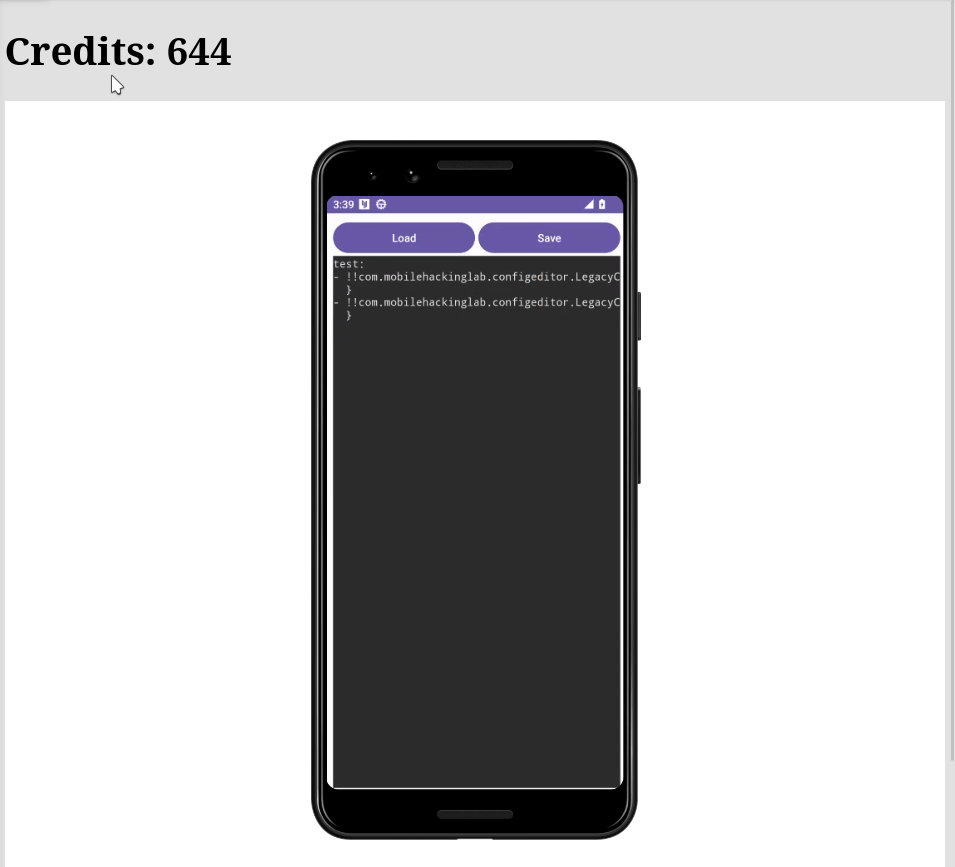
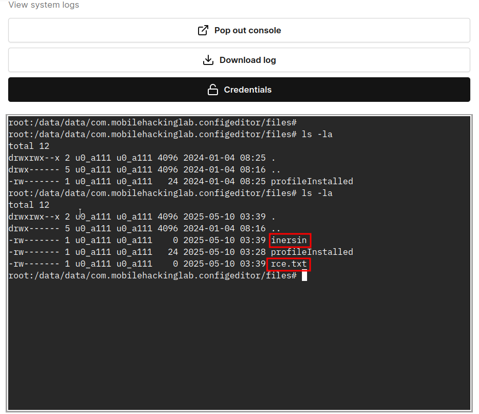

# Enumeration

1. The app is vulnerable to yaml.snakeyaml for detail the package "org.yaml.snakeyaml" [CVE-2022-1471](https://snyk.io/blog/unsafe-deserialization-snakeyaml-java-cve-2022-1471/).

2. The app is have function to execute command injection but never been called, we can used snakeyaml vulnerability to call this function.

   
4. The yaml.snakeyaml is vulnerable to java deserialization when loading file config *.yml.

5. We create `exploit.yml` look like below.
```yml
test:
    - !!com.mobilehackinglab.configeditor.LegacyCommandUtil ["touch /data/data/com.mobilehackinglab.configeditor/files/inersin"]
    - !!com.mobilehackinglab.configeditor.LegacyCommandUtil ["touch /data/data/com.mobilehackinglab.configeditor/files/rce.txt"]
```
We create file inside the package path it self, because we only allowed do write in it self path.

# Exploitation
1. Paste our exploit to Config Editor app.

2. Save it as `example.yml` (which in my case later will rename as "example2.yml")

3. And load the latest "example.yml" in my case it's "example2.yml".

4. Our payload is loaded.

5. Use terminal to check if the file is created.

