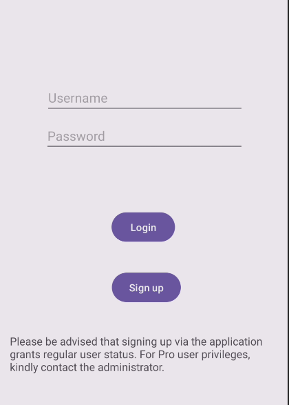
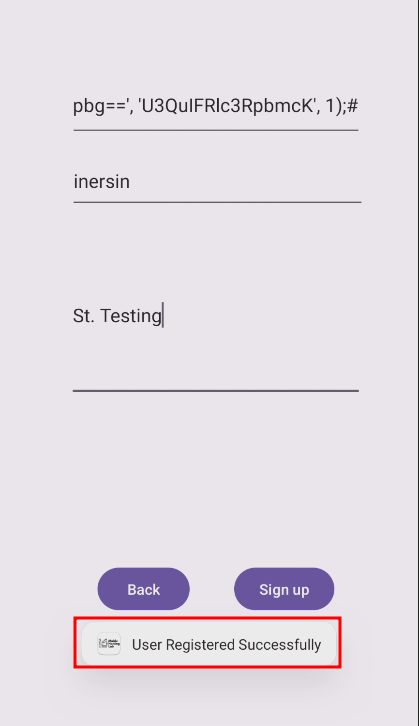

# Analysis
1. In this lab, the author is already pointed the vulnerability so we just go straight to `Signup` functionality.
2. In `Signup` class, user need to input all field.


3. Then the application is called class `User` with user input to make something like struct and called function `addUser` that been initialized as `dbHelper`


4. In function `addUser`, the function is used user input in raw sql query, which is causing sql injection vulnerability.


5. But we can see the field adddress and password is being encode as base64, that makes we only able to control the username field.


6. So we need to craft the payload injection in username.

# Exploitation
1. Run the application, navigate to Sign Up.



2. First we input basic sql injection by add `'` in username field.


3. We can see in adb log is logged the sql error.


4. Based on error that being logged, we can craft the payload and don't forget to encoded the password and address so it's still valid when we try login.
```txt
inersin', 'aW5lcnNpbg==', 'U3QuIFRlc3RpbmcK', 1);#
```

5. Insert the payload into username field and the application toastes `User Registered Successfully`.


6. Login with injected user and password.


# Extra Steps
1. If we can't login even when the application toasted message "success", we can try open the local sqlite db by pull the db into our hosts.

2. Copy the `/data/data/com.mobilehackinglab.foodstore/databases/userdatabase.db` into `/data/local/tmp/` and change the permission to allowed access for all users.

3. Pull the db into our host using `adb pull /data/local/tmp/foodstore.db .`


4. Open the db.


5. By do some this extra step, we can check and  make sure is our payload injection working properly, in our case the password base64 we injected is included neweline, that's why when we try login it's keep say the account is invalid :)
