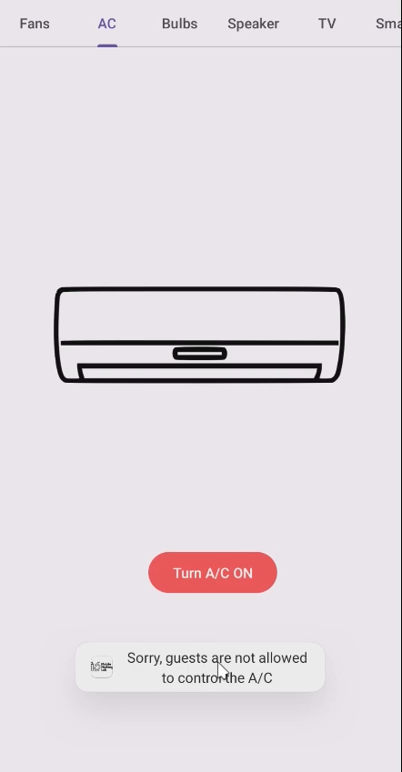

# Analysis
1. We check the `AndroidManifes.xml` and found the class that handled Broadcast.


2. Then i just straight check the function `HomeActivity`, which is has two activity we can trigger, `IoTNavigationActivity` and `MasterSwitchActivity`.


3. In `IoTNavigationActivity` we can turn on and turn off devices, but there is some devices that can't controlled by guest.


4. For example in `BulbFragment` is not check for is user a guest, but in `ACFragment` is do check user.
- BulbFragment

- ACFragment


5. In `MasterSwitchActivity` we need to input pin and will send the broadcast and this code is vuln becaused it's only restrict guest to access in client-side for accessing the functionality to turn on all devices.


6. There is class `CommunicationManager` that handled the incoming `Intent` broadcast.


7. Function `initialize` in class `CommunicationManager` it's do check the input we broadcast from intent using function `check_key` in class `Checker` and if the result is correct/true, we can turn on all devices.


8. Function `check_key` in class `Checker` is used pin that we provided to as key to decrypt data from variable `DS` and check the is the decrypt result equals to "master_on".

9. The function `decrypt` is using AES encryption.


10. Based on the analysis, we can do intent broadcast but we need to find the correct pin first, then we can turn on all devices.

# Exploitation
1. Register user and login.


2. Try turn on devices.
- Allowed devices.

   

- Not allowed devices.

   

3. Try access Master Switch.


4. Based on function `decrypt`, we can copy the code and make our own java code, so we able to emulated the decrypt check pin functionality.


5. In our own `Checker.java`, we can do bruteforce the pin from 0-999 and find the decrypt result that match "master_on", that way we able to find the correct pin.


6. After found the correct pin, we can't just use the pin to access Master Switch because it's check guest user.

   

7. We can just use `Intent` to do broadcast with specified the correct pin as value of parameter `key`
```sh
am broadcast -a MASTER_ON --ei key 345
```


8. And the application is toasted `All devices are turned on` and we can check the devices again is all turned on.


