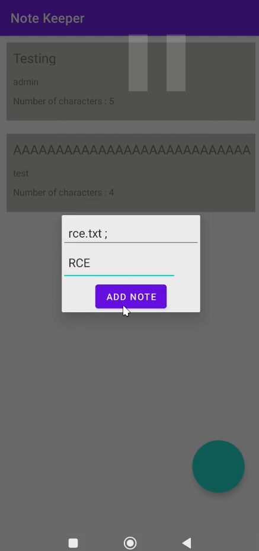

# Analysis
1. The author is already pointed the vulnerability, so i just assumed the vuln code is in shared object function.

2. The native function is in `MainActivity`.

   

3. Function `parse` is called when user add new note and used title parameter that user input as argument.

   

4. There is only one lib file and i open it in Ghidra.

   

   

5. The function parse is named `Java_com_mobilehackinglab_notekeeper_MainActivity_parse`.

   

6. This native function is do memcpy string `Log \"Note added at $(date)\"` to `dest` with sized 500, that later will used the variable `dest` to execute command using `system(dest)`.

   

7. And also get our title length and used it for loop through each char our title and copy it to `title_copy` which the can caused buffer overflow.

   

8. because the length that being used for loop is length string that controlled by user and can overflow size of `title_copy`, if the user input title with length over than 100, it will writing the title out of memory that allocated for `title_copy` and will overwrite variable `dest`.

   

9by overflow the `title_copy` and overwrite data in `dest` we can inject our malicious code and gained RCE.


# Exploitation
1. Run the application.

   

2. To debug if our payload is overwrite into variable `dest` inside native lib that later will used to in `system`, we make frida script to hook `system` function and print out the argument.
```js
Java.perform(() => {
    Interceptor.attach(Module.findExportByName("libc.so", "system"), {
        onEnter: (args) => {
            var cmd = Memory.readCString(args[0])
            console.log(`dest: ${cmd}`)
        }
    })
})
```
3. We run and add note normal to see if the debug is works.

   

4. Now we need to overflow the `title_copy`, the size of `title_copy` is 100, so we need to make buffer with 100 char and add dummy data at the end of buffer.
```py
"A"*100+"BBBBCCCC"
```

4. We can see our payload is overflow the `title_copy` and overwrite data inside variable `dest`.

   

5. Now we can replaced string `BBBBCCCC` with malicious command injection.
```py
"A"*100+"malicious command"
```

   

6. Input our payload into title field and "Add Note"

   

7. Now check the directory and our file is created.

   